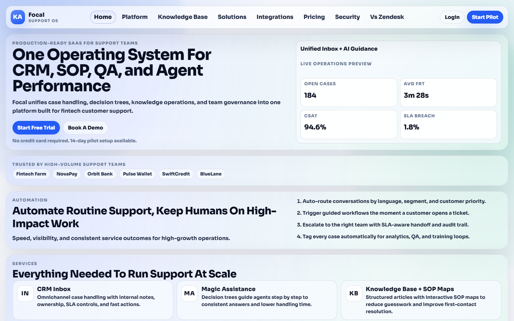
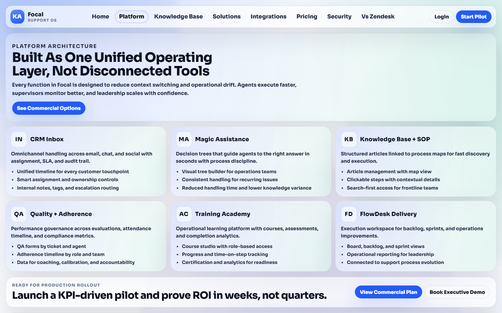
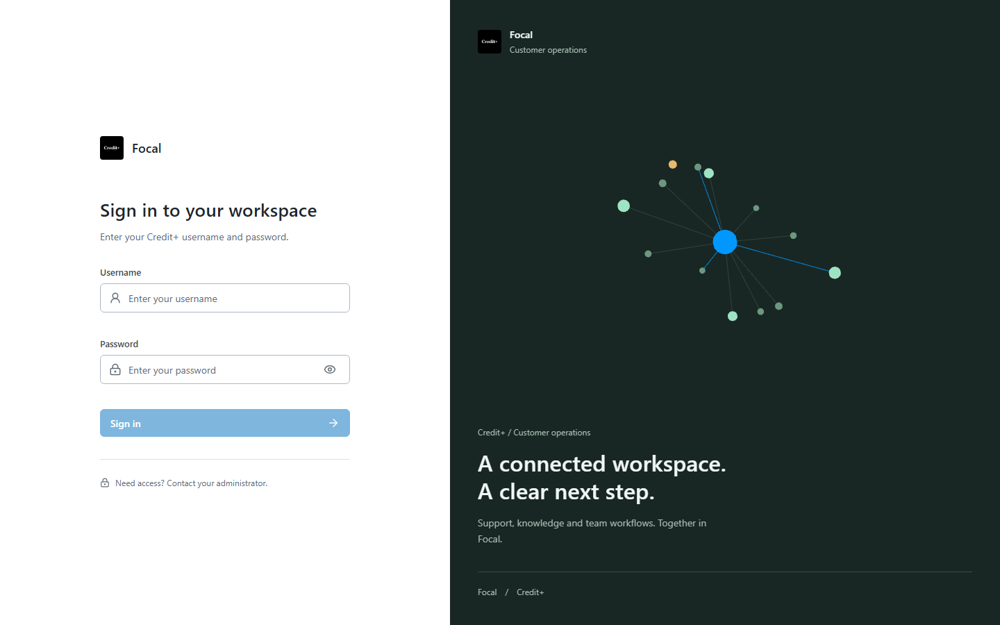

# Focal

### Customer support, knowledge, and team operations in one clear workspace.

Focal brings cases, SOPs, decision maps, quality, training, collaboration, and delivery work into one operating layer for high-volume support teams.

  <a href="#what-focal-is">What it is</a> ·
  <a href="#inside-the-workspace">Explore the workspace</a> ·
  <a href="#run-focal-locally">Run locally</a> ·
  <a href="#deploy-with-docker">Deploy with Docker</a>

  

## What Focal Is

Support teams rarely struggle because they lack another inbox. They struggle because the answer, the procedure, the permission, and the follow-up live in different places.

Focal is designed around the moment an operator needs to make a good decision. It connects the customer conversation to the next best step, the approved source of truth, the person who owns the work, and the training that keeps the whole team consistent.

It is built for teams that care about more than closing tickets:

- fintech and lending support
- high-volume customer operations
- quality and adherence teams
- knowledge and process owners
- internal service desks
- teams with regulated or approval-heavy workflows

## The Focal Loop

<table>
  <tr>
    <td width="20%"><strong>01 Capture</strong> Cases, chats, requests, and customer context arrive in one workspace.</td>
    <td width="20%"><strong>02 Guide</strong> Articles, SOP maps, and decision trees turn uncertainty into a clear next step.</td>
    <td width="20%"><strong>03 Govern</strong> Roles, validation chains, audit trails, and permissions keep work controlled.</td>
    <td width="20%"><strong>04 Coach</strong> Academy courses, QA, and adherence data show where people need support.</td>
    <td width="20%"><strong>05 Improve</strong> Operational signals feed better content, better workflows, and better outcomes.</td>
  </tr>
</table>

## Inside The Workspace

<table>
  <tr>
    <td width="50%">
      
    </td>
    <td width="50%" valign="top">
      <h3>One operating layer</h3>
      
The workspace is intentionally broad, but the experience stays focused. Each surface is connected to the same roles, knowledge, workflows, and operational context.

      <ul>
        <li><strong>CRM Inbox</strong> for cases, ownership, internal notes, tags, SLA controls, and customer history.</li>
        <li><strong>Knowledge Base and Knowledge Hub</strong> for structured articles, search, categories, and SOP-led reading.</li>
        <li><strong>Magic Assistance</strong> for decision trees that guide operators through repeatable processes.</li>
        <li><strong>Academy</strong> for courses, quizzes, certificates, and readiness tracking.</li>
        <li><strong>FlowDesk</strong> for backlog, boards, sprints, reports, and operational follow-through.</li>
        <li><strong>Quality and Adherence</strong> for evaluation, coaching, attendance, and accountability.</li>
      </ul>
    </td>
  </tr>
</table>

## Product Surfaces

| Surface | What it helps teams do |
| --- | --- |
| Command Center | Move between the tools that matter without losing the operational thread. |
| CRM Inbox and Live Chat | Handle conversations, assign ownership, collaborate privately, and escalate cleanly. |
| Knowledge Base | Search approved articles and connect content to the work agents are doing. |
| SOP Maps and Decision Trees | Make branching procedures visible, clickable, and easier to execute consistently. |
| Article Editor and Validation | Draft, revise, comment, approve, reject, and publish controlled knowledge. |
| Knowledge Hub | Give teams a calmer, search-first way to browse operational content. |
| Role and Channel Access Maps | See which roles can access which tools and channels. |
| Academy | Build courses around real procedures and track completion and readiness. |
| QA and Adherence | Turn reviews, evaluations, and timelines into coaching signals. |
| FlowDesk | Keep improvement work visible through boards, backlog, sprints, and reports. |
| Process Assistant | Give operators a role-aware assistant grounded in workspace context. |
| Collaboration Hub | Keep conversations, threads, reactions, pins, and shared work close to the source. |

## A Few Views

<table>
  <tr>
    <td width="50%"></td>
    <td width="50%"></td>
  </tr>
  <tr>
    <td align="center">A focused entry point for the workspace.</td>
    <td align="center">A product view built around clear next steps.</td>
  </tr>
</table>

## Why The Shape Matters

Focal is not trying to make every support problem look like a ticket. Some problems are conversations. Some are procedures. Some are permission questions. Some are coaching gaps. Some are delivery work that only becomes visible after the same issue has happened twenty times.

The product gives each kind of work a useful surface while keeping the context connected. That is the central design choice behind the project.

## Current Status

This repository contains an active product build with a working Angular frontend, Spring Boot API, MySQL persistence, role-aware routes, rich knowledge workflows, interactive maps, training surfaces, and optional Three.js experiences.

It is not yet a turnkey, hosted multi-tenant SaaS distribution. A public deployment still needs environment-specific secrets, database provisioning, sanitized seed data, observability, backups, and a production identity and email setup.

## Run Focal Locally

### Prerequisites

- Node.js 20 or newer
- npm 11 or a compatible npm version
- Java 17 or newer
- MySQL or MariaDB with a database named `focal_db`
- Git
- Docker Desktop, only if you prefer the container workflow

### 1. Start the backend

Create the database first:

~~~sql
CREATE DATABASE focal_db CHARACTER SET utf8mb4 COLLATE utf8mb4_unicode_ci;
~~~

Configure the connection with environment variables when your local database does not use the defaults:

~~~powershell
$env:SPRING_DATASOURCE_URL = "jdbc:mysql://localhost:3306/focal_db"
$env:SPRING_DATASOURCE_USERNAME = "root"
$env:SPRING_DATASOURCE_PASSWORD = "your-password"
$env:SECURITY_JWT_SECRET = "replace-with-a-long-random-local-secret"
~~~

Then run Spring Boot:

~~~powershell
cd backend
.\mvnw.cmd spring-boot:run
~~~

On macOS or Linux:

~~~bash
cd backend
./mvnw spring-boot:run
~~~

The API listens on `http://localhost:8080`.

### 2. Start the frontend

Open a second terminal:

~~~bash
cd frontend
npm ci
npm run start:dev
~~~

The Angular development server proxies `/api/*` and `/auth/*` to the backend.

Open `http://localhost:4200/login`.

### 3. Optional: start the Akinator gateway

The games menu uses a small local gateway for the Akinator integration. The rest of Focal does not depend on it.

~~~bash
cd frontend
npm run start:akinator
~~~

It listens on `http://localhost:4201`.

## Deploy With Docker

### Frontend image

The frontend includes an nginx image that serves the Angular build and proxies API requests.

~~~bash
cd frontend
docker build -f Dockerfile.web -t focal-web:latest .
docker run --rm -p 4200:80 \
  -e BACKEND_UPSTREAM=http://host.docker.internal:8080 \
  focal-web:latest
~~~

Or run the local frontend containers together:

~~~bash
cd frontend
docker compose up --build
~~~

### Backend image

Create a private environment file from the example and replace every placeholder before starting the image:

~~~bash
cp backend/.env.oci.example backend/.env.local
docker build -t focal-api:latest ./backend
docker run --rm -p 8080:8080 --env-file backend/.env.local focal-api:latest
~~~

The backend expects a reachable MySQL database. Keep port `8080` and port `3306` private behind the frontend or a reverse proxy.

### Single-VM deployment

The VM compose file can run MySQL, the API, and the web container together. Before using it in a public clone, provide sanitized schema and seed data and set the build context to this repository's backend:

~~~bash
cd frontend
cp .env.vm.example .env.vm
# Set BACKEND_CONTEXT=../backend and fill every required secret in .env.vm.
docker compose --env-file .env.vm -f docker-compose.vm.yml up -d --build
~~~

The Oracle Cloud deployment notes are in [`frontend/docs/oracle-cloud-free-tier-deployment.md`](frontend/docs/oracle-cloud-free-tier-deployment.md).

## Public Testing From A Local Machine

For a temporary external test URL, install Cloudflare Tunnel and run the backend and frontend first:

~~~bash
cd frontend
npm run start:public
~~~

The launcher starts or reuses the frontend and Akinator gateway, keeps the backend behind the frontend proxy, and prints a temporary `https://*.trycloudflare.com` URL.

This is for testing only. A quick tunnel is not a production hosting strategy and the local computer must remain on.

## Project Shape

~~~text
.
├── backend/                  Spring Boot API, security, persistence, WebSocket handlers
├── frontend/                 Angular application, Docker images, proxy, gateway
├── docs/                     Product and deployment documentation
└── docs/readme/              Public README captures
~~~

The application is intentionally split into a UI and an API:

~~~text
Browser
  -> Angular / nginx frontend
     -> Spring Boot API and WebSocket layer
        -> MySQL
        -> optional Gmail, Meta, OpenAI, and Akinator integrations
~~~

## Useful Checks

~~~bash
cd frontend
npx tsc --noEmit -p tsconfig.app.json
npm run build:prod

cd ../backend
./mvnw test
~~~

On Windows, use `..\mvnw.cmd test` from the backend directory.

## Before Publishing A Public Repository

This workspace contains private and generated material that must not be committed as-is. In particular:

- never commit `.env` files or secret values
- never commit real customer records, email history, chat transcripts, or seeded passwords
- never commit SQL dumps unless they have been replaced with sanitized schema and demo data
- rotate any credential that has ever appeared in a local dump or log
- review third-party licenses and remove private client assets
- use a production JWT secret and configure CORS for the real public origin

The root `.gitignore` is configured to keep the most obvious local secrets, dumps, logs, caches, and duplicate workspace out of a first public commit. Still review `git diff --cached` before pushing.

This working folder also contains independent Git metadata under `frontend/` and `backend/`. If you want one clean public monorepo, publish from a clean export or deliberately remove those nested `.git` directories in the export. Do not blindly run `git add -A` from this mixed workspace.

## Contributing

Focal is most useful when new work improves an actual operator workflow. For a contribution:

1. Open an issue describing the operational problem.
2. Explain the intended user and the measurable improvement.
3. Keep UI, API, permissions, and documentation changes together.
4. Add or update a focused test where the behavior is not visual-only.
5. Run the frontend and backend checks before opening a pull request.

## License

No open-source license has been selected for this repository yet. Public visibility alone does not grant permission to reuse, modify, or redistribute the code. Add a deliberate license before presenting Focal as an open-source project.

## Name And Scope

Focal is an independent project. Product names, customer names, workflows, logos, and integrations from any private deployment should be treated as separate from the reusable platform work until explicitly cleared for publication.
