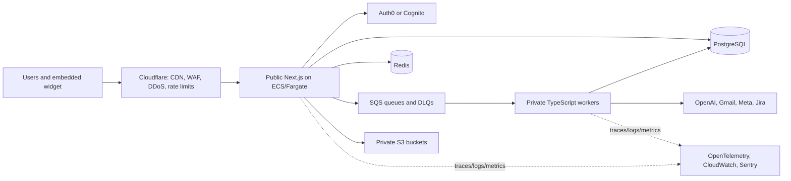

# Focal - Complete Project Rebuild Documentation (Split Index)

> This is the master index for the split documentation. Each section is in a separate Markdown file for easier navigation and maintenance.

---

## 📚 Documentation Files

| # | File | Description |
|---|------|-------------|
| **01** | [01-project-overview.md](01-project-overview.md) | Project overview, tech stack, complete database schema (all 20+ tables with SQL) |
| **02** | [02-api-endpoints.md](02-api-endpoints.md) | Complete REST API reference (100+ endpoints across 18 controllers) |
| **03** | [03-frontend-architecture.md](03-frontend-architecture.md) | V3 Shell architecture, routing, component inventory, RBAC matrix |
| **04** | [04-auth-flow.md](04-auth-flow.md) | OIDC session authentication, authorization policy, and legacy JWT migration reference |
| **05** | [05-ui-ux-core-pages.md](05-ui-ux-core-pages.md) | Detailed UI/UX for V3 Shell, Home, KB, Magic Assistance, CRM/FlowDesk |
| **06** | [06-ui-ux-collab-ai.md](06-ui-ux-collab-ai.md) | Collaboration Hub, Process Assistant, Live Chat, Chat Projects |
| **07** | [07-ui-ux-builders.md](07-ui-ux-builders.md) | Canvas builders (KB Map, Tree, Case Tag), Article Management, Role Access Map, Settings, Academy, Admin pages |
| **08** | [08-ui-ux-other-pages.md](08-ui-ux-other-pages.md) | Login, 404, Design System (CSS variables, tokens, animations), Responsive breakpoints, User flows, State management |
| **09** | [09-backend-architecture.md](09-backend-architecture.md) | Next.js server modules, security, services, OpenAI, Gmail, PostgreSQL, and workers |
| **10** | [10-deployment-ops.md](10-deployment-ops.md) | Build, Docker, Docker Compose, Nginx, SSL, CI/CD, monitoring, backup, troubleshooting |

---

## 🎯 Quick Start for Rebuild

### Prerequisites
- Node.js 20+, npm 10+
- PostgreSQL 15+
- OpenAI API key (for Process Assistant)

### 1. Database
```bash
createdb focal_assist
```

### 2. Full-stack application
```bash
cd frontend
npm install
npm run dev
# Opens http://localhost:3000
```

### 3. Default Login
After migrations and seed data run, register through the application or use the documented development seed account.

---

## 🏗️ Architecture Highlights

### Full Stack (Next.js)
- **V3 Shell:** App Router layouts, responsive sidebar drawer, feature-gated navigation
- **Server and Client Components:** server-enforced authorization and feature flags
- **Canvas-based builders:** KB Map, Tree, Case Tag (drag-drop, pan/zoom, wire connections)
- **Real-time collaboration:** Polling-based (messages, typing, presence)
- **TinyMCE 8.3.2** for rich text editing
- **CSS Variables design system:** 4px spacing, semantic tokens, 4 breakpoints

- **OIDC Authentication:** secure `httpOnly` server-side sessions
- **Role-Based Access Control:** 6 roles × 25 features, dynamic config via API
- **Multi-channel CRM:** Gmail, WhatsApp, Instagram, Widget
- **Process Assistant:** OpenAI integration through server-only modules
- **Typed PostgreSQL access:** migrations, constraints, indexes, and RLS

### Key Integrations
- **Gmail:** OAuth2, thread sync, attachment handling
- **Meta (WhatsApp/Insta):** OAuth2, webhook handling
- **OpenAI:** Chat completions for Process Assistant
- **Jira:** Issue linking from settings

---

## 📋 Feature Catalog (25 Features)

| Feature | Route | Roles |
|---------|-------|-------|
| command_center | /v3/home | All |
| calendar | /v3/calendar | All |
| magic_assistance | /v3/magic-assistance | All |
| knowledge_base | /v3/knowledge-base | All |
| knowledge_analytics | /v3/kb-analytics | ADMIN, HEAD_CS, OPS, QA |
| article_management | /v3/article-management | ADMIN, HEAD_CS, OPS |
| collaboration | /v3/collaboration | All |
| chat_projects | /v3/chat-projects | ADMIN, HEAD_CS, OPS |
| live_chat | /v3/live-chat | All |
| process_assistant | /v3/process-assistant | All |
| academy_home | /v3/academy | All |
| academy_catalog | /v3/academy/catalog | All |
| academy_studio | /v3/academy/studio | ADMIN, HEAD_CS, OPS, TEAM_LEADER, QA |
| academy_analytics | /v3/academy/analytics | ADMIN, HEAD_CS, OPS, TEAM_LEADER, QA |
| flowdesk | /v3/flowdesk/board | All |
| escalation_desk | /v3/flowdesk/escalations | ADMIN, OPS, QA |
| qa_evaluation | /v3/qa-evaluation | ADMIN, QA, TEAM_LEADER |
| adherence | /v3/adherence-dashboard | ADMIN, OPS, TEAM_LEADER |
| team_management | /v3/team-management | ADMIN, TEAM_LEADER |
| builders | /v3/tree-builder, /v3/kb-map-builder, /v3/case-tag-builder | ADMIN, HEAD_CS |
| prompt_map_builder | /v3/prompt-map-builder | ADMIN |
| user_settings | /v3/settings | All |
| staff_management | /v3/staff-management | ADMIN |
| role_access_map | /v3/role-access-map | ADMIN |
| channel_access_map | /v3/channel-access-map | ADMIN |

---

## 🔗 Cross-References

- **Database Schema** → `01-project-overview.md` (Section 2)
- **API Endpoints** → `02-api-endpoints.md` (Section 3)
- **Frontend Routes** → `03-frontend-architecture.md` (Section 4.1)
- **Auth Flow** → `04-auth-flow.md` (Section 5)
- **Core Page UI** → `05-ui-ux-core-pages.md` (Sections 15.1-15.5)
- **Collab/AI UI** → `06-ui-ux-collab-ai.md` (Sections 15.6-15.9)
- **Builder/Admin UI** → `07-ui-ux-builders.md` (Sections 15.10-15.25)
- **Design System** → `08-ui-ux-other-pages.md` (Section 15.29)
- **Backend Structure** → `09-backend-architecture.md` (Section 6)
- **Deployment** → `10-deployment-ops.md` (Section 7)

---

## 📝 Notes for Rebuild

1. **Start with the Next.js full stack** — establish server-only modules and page boundaries together
2. **Run PostgreSQL migrations** — use versioned forward-only migrations; never rely on automatic schema updates
3. **Configure OAuth** — Gmail & Meta credentials needed for full CRM/Chat features
4. **Set session and OIDC secrets** — keep them in the environment or a managed secrets store, never source control
5. **Enable HTTPS** — Required for OAuth callbacks in production
6. **Monitor OpenAI costs** — Process Assistant uses gpt-4o-mini by default

---

*Generated from source code analysis. All code paths, models, endpoints, and UI components documented as of current codebase state.*

---

# Production Architecture Adaptation

> **Migration notice:** source-system implementation details are retained where they preserve useful behaviour, fields, endpoints, or operational knowledge. The Next.js full-stack and PostgreSQL decisions in this folder are authoritative. Any remaining Spring Boot, Angular, MySQL, or browser-JWT snippets are legacy migration references, not target implementation instructions.

## Executive Architecture Summary

Focal becomes a multi-tenant SaaS delivered through Cloudflare. A Next.js/TypeScript full-stack application provides the web experience, server-rendered pages, Route Handlers, Server Actions, and business rules. PostgreSQL is the authoritative system of record; Redis is only for short-lived cache, rate limits, locks, and presence; SQS and idempotent TypeScript workers process durable asynchronous work; S3 stores private uploads. AWS services run in private networking and all infrastructure is reproducible with Terraform.

The existing product scope is retained: support CRM, knowledge base and maps, decision trees, collaboration, academy, QA, live chat, AI assistance, integrations, roles, and administration. It is not assumed to have payments. **[ARCHITECTURAL DECISION REQUIRED]** If subscriptions or paid plans are added, isolate Stripe webhooks and billing data in a dedicated bounded module; never store card data.

## Target Technology Stack

| Layer | Production choice | Reason |
|---|---|---|
| Full stack | Next.js, React, TypeScript | SSR, streaming, Route Handlers, Server Actions, server-only data access, and a secure browser boundary |
| Server/workers | Shared TypeScript server modules plus queue workers | One language and one modular domain model across request and background processing |
| Data | PostgreSQL with Drizzle ORM, Kysely, or typed `pg` queries | Transactions, constraints, RLS, and query control |
| Ephemeral | Redis | Cache, rate limits, distributed locks, presence and short-lived state—not truth |
| Async/files | SQS/DLQs and private S3 | Durable retries and controlled file access |
| Identity | Amazon Cognito or Auth0 | Mature MFA, passkeys, revocation, and short-lived tokens |
| Edge/IaC/ops | Cloudflare, AWS ECS/Fargate, Terraform, GitHub Actions, OpenTelemetry, Sentry | Defense in depth and repeatable operations |

## System Architecture



Public: Cloudflare, explicitly exposed Next.js routes, identity-provider authorization endpoints, and verified webhooks. Private: server modules, workers, PostgreSQL, Redis, SQS consumers, and S3. The browser is always untrusted; it never decides roles, tenants, ownership, or permissions.

## Adapted Document Map

| Target document | Added production content |
|---|---|
| `01-project-overview.md` | tenant-aware PostgreSQL schema, RLS, migrations, indexes |
| `02-api-endpoints.md` | API policy, contracts, authorization, idempotency |
| `03-frontend-architecture.md` | Next.js full-stack application, default editorial UI rule, and server-client boundaries |
| `04-auth-flow.md` | OIDC, sessions, CSRF, authorization |
| `05`–`08` | retained UX implemented with secure Next.js patterns and end-to-end flows |
| `09-backend-architecture.md` | TypeScript server modules, async work, performance, reliability |
| `10-deployment-ops.md` | AWS/Terraform, CI/CD, observability, checklists, roadmap |

## Changes From the Original Blueprint

| Original | New architecture | Reason |
|---|---|---|
| Angular SPA with browser JWT | Next.js with server-side OIDC session | Reduces token exposure and enforces server boundary |
| Spring Boot/JPA | Next.js full stack with shared TypeScript server modules and workers | One cohesive application model with strict server-only boundaries |
| MySQL | PostgreSQL | RLS, stronger relational features, and managed resilience |
| Local blobs | Private S3 with signed URLs | Secure, scalable file delivery |
| Scheduled in-process jobs | SQS plus workers and DLQs | Durable, retryable background processing |
| Docker Compose/Nginx host | ECS/Fargate behind Cloudflare | Private networking, horizontal scaling, repeatability |

Detailed decisions, risks, and migration treatment appear in the adapted sections in each document.
