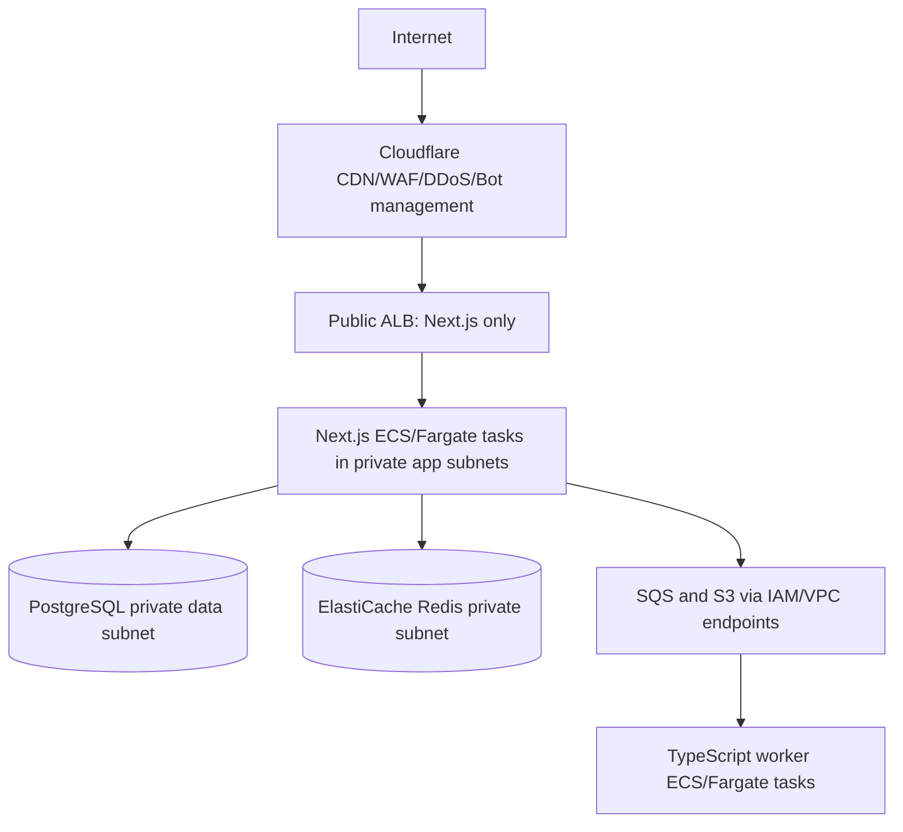

# Focal - Deployment & Operations

> Build, deployment, environment setup, and operational procedures. Legacy Docker, Spring Boot, Angular, MySQL, and JWT snippets are retained for migration reference; the authoritative production target is Next.js full stack with PostgreSQL in the adaptation below.

---

## 7. DEPLOYMENT & OPERATIONS

### 7.1 Frontend Build & Deploy

**Development:**
```bash
cd frontend
npm install
npm run start:dev          # Dev server at http://localhost:4200
```

**Production Build:**
```bash
cd frontend
npm run build:prod         # Outputs to dist/focal-assist/browser/
```

**SSR (Server-Side Rendering):**
```bash
cd frontend
npm run serve:ssr:focal-assist  # Node.js server at localhost:4000
```

**Docker (Frontend):**
```dockerfile
# Multi-stage build
FROM node:20-alpine AS builder
WORKDIR /app
COPY package*.json ./
RUN npm ci
COPY . .
RUN npm run build:prod

FROM nginx:alpine
COPY --from=builder /app/dist/focal-assist/browser /usr/share/nginx/html
COPY nginx.conf /etc/nginx/conf.d/default.conf
EXPOSE 80
CMD ["nginx", "-g", "daemon off;"]
```

### 7.2 Backend Build & Deploy

**Development:**
```bash
cd backend
./mvnw spring-boot:run     # API at http://localhost:8080
```

**Production Build:**
```bash
cd backend
./mvnw clean package -DskipTests
# Output: target/focal-assist-0.0.1-SNAPSHOT.jar
```

**Run JAR:**
```bash
java -jar target/focal-assist-0.0.1-SNAPSHOT.jar \
  --spring.profiles.active=prod \
  --server.port=8080
```

**Docker (Backend):**
```dockerfile
FROM eclipse-temurin:21-jdk-alpine AS builder
WORKDIR /app
COPY .mvn .mvn
COPY mvnw pom.xml ./
RUN ./mvnw dependency:go-offline -B
COPY src src
RUN ./mvnw clean package -DskipTests

FROM eclipse-temurin:21-jre-alpine
WORKDIR /app
COPY --from=builder /app/target/focal-assist-*.jar app.jar
EXPOSE 8080
ENTRYPOINT ["java", "-jar", "app.jar"]
```

### 7.3 Docker Compose (Full Stack)

```yaml
# docker-compose.yml
version: '3.8'

services:
  mysql:
    image: mysql:8.0
    environment:
      MYSQL_ROOT_PASSWORD: ${DB_PASSWORD}
      MYSQL_DATABASE: focal_db
    volumes:
      - mysql_data:/var/lib/mysql
    ports:
      - "3306:3306"
    healthcheck:
      test: ["CMD", "mysqladmin", "ping", "-h", "localhost"]
      interval: 10s
      timeout: 5s
      retries: 5

  backend:
    build: ./backend
    environment:
      SPRING_PROFILES_ACTIVE: prod
      DB_USER: root
      DB_PASSWORD: ${DB_PASSWORD}
      JWT_SECRET: ${JWT_SECRET}
      OPENAI_API_KEY: ${OPENAI_API_KEY}
      GMAIL_CLIENT_ID: ${GMAIL_CLIENT_ID}
      GMAIL_CLIENT_SECRET: ${GMAIL_CLIENT_SECRET}
      GMAIL_REDIRECT_URI: ${GMAIL_REDIRECT_URI}
      META_APP_ID: ${META_APP_ID}
      META_APP_SECRET: ${META_APP_SECRET}
      META_REDIRECT_URI: ${META_REDIRECT_URI}
    ports:
      - "8080:8080"
    depends_on:
      mysql:
        condition: service_healthy

  frontend:
    build: ./frontend
    ports:
      - "80:80"
    depends_on:
      - backend

volumes:
  mysql_data:
```

### 7.4 Environment Variables (Required)

| Variable | Description | Required |
|----------|-------------|----------|
| `DB_PASSWORD` | MySQL root password | Yes |
| `JWT_SECRET` | Min 32 chars, HS256 signing key | Yes |
| `OPENAI_API_KEY` | For Process Assistant | Yes |
| `GMAIL_CLIENT_ID` | Google OAuth client ID | For Gmail sync |
| `GMAIL_CLIENT_SECRET` | Google OAuth secret | For Gmail sync |
| `GMAIL_REDIRECT_URI` | OAuth callback URL | For Gmail sync |
| `META_APP_ID` | Meta (FB/Insta/WhatsApp) App ID | For Chat Projects |
| `META_APP_SECRET` | Meta App Secret | For Chat Projects |
| `META_REDIRECT_URI` | Meta OAuth callback | For Chat Projects |

### 7.5 Database Setup

**Initial Migration:**
```bash
# Option 1: Hibernate auto-update (dev only)
spring.jpa.hibernate.ddl-auto: update

# Option 2: Flyway/Liquibase (prod recommended)
# Create migration scripts in src/main/resources/db/migration/
```

**Manual Setup:**
```sql
CREATE DATABASE focal_db CHARACTER SET utf8mb4 COLLATE utf8mb4_unicode_ci;
CREATE USER 'focal_user'@'%' IDENTIFIED BY 'secure_password';
GRANT ALL PRIVILEGES ON focal_db.* TO 'focal_user'@'%';
FLUSH PRIVILEGES;
```

### 7.6 Nginx Reverse Proxy (Production)

```nginx
# /etc/nginx/sites-available/focal-assist
server {
    listen 80;
    server_name focal-assist.yourdomain.com;

    # Frontend
    location / {
        proxy_pass http://frontend:80;
        proxy_set_header Host $host;
        proxy_set_header X-Real-IP $remote_addr;
    }

    # Backend API
    location /api/ {
        proxy_pass http://backend:8080;
        proxy_set_header Host $host;
        proxy_set_header X-Real-IP $remote_addr;
        proxy_set_header X-Forwarded-For $proxy_add_x_forwarded_for;
        proxy_set_header X-Forwarded-Proto $scheme;
        
        # WebSocket support (if added later)
        proxy_http_version 1.1;
        proxy_set_header Upgrade $http_upgrade;
        proxy_set_header Connection "upgrade";
        
        # Increase timeouts for AI calls
        proxy_read_timeout 120s;
        proxy_send_timeout 120s;
    }

    # Static assets caching
    location /assets/ {
        proxy_pass http://frontend:80;
        expires 1y;
        add_header Cache-Control "public, immutable";
    }
}
```

### 7.7 SSL/TLS (Let's Encrypt)

```bash
# Install certbot
sudo apt install certbot python3-certbot-nginx

# Obtain certificate
sudo certbot --nginx -d focal-assist.yourdomain.com

# Auto-renewal (cron)
0 3 * * * /usr/bin/certbot renew --quiet
```

### 7.8 Monitoring & Health Checks

**Backend Health Endpoint:**
```yaml
# application.yml
management:
  endpoints:
    web:
      exposure:
        include: health,info,metrics,prometheus
  endpoint:
    health:
      show-details: always
```

**Health Check URLs:**
- Backend: `GET /actuator/health`
- Frontend: `GET /` (nginx returns 200)

**Key Metrics to Monitor:**
- JVM heap usage
- Database connection pool (HikariCP)
- Request latency (p50, p95, p99)
- Error rate (5xx)
- Active WebSocket connections (if added)

### 7.9 Logging

**Logback Configuration (logback-spring.xml):**
```xml
<configuration>
    <springProperty scope="context" name="appName" source="spring.application.name"/>
    
    <appender name="CONSOLE" class="ch.qos.logback.core.ConsoleAppender">
        <encoder>
            <pattern>%d{yyyy-MM-dd HH:mm:ss.SSS} [%thread] %-5level %logger{36} - %msg%n</pattern>
        </encoder>
    </appender>
    
    <appender name="FILE" class="ch.qos.logback.core.rolling.RollingFileAppender">
        <file>logs/${appName}.log</file>
        <rollingPolicy class="ch.qos.logback.core.rolling.TimeBasedRollingPolicy">
            <fileNamePattern>logs/${appName}.%d{yyyy-MM-dd}.%i.log.gz</fileNamePattern>
            <maxFileSize>100MB</maxFileSize>
            <maxHistory>30</maxHistory>
            <totalSizeCap>3GB</totalSizeCap>
        </rollingPolicy>
        <encoder>
            <pattern>%d{yyyy-MM-dd HH:mm:ss.SSS} [%thread] %-5level %logger{36} - %msg%n</pattern>
        </encoder>
    </appender>
    
    <root level="INFO">
        <appender-ref ref="CONSOLE"/>
        <appender-ref ref="FILE"/>
    </root>
    
    <logger name="com.focal.api" level="DEBUG"/>
    <logger name="org.springframework.security" level="DEBUG"/>
</configuration>
```

### 7.10 Backup Strategy

**Database Backup (Daily):**
```bash
#!/bin/bash
# backup-db.sh
DATE=$(date +%Y%m%d_%H%M%S)
mysqldump -u root -p${DB_PASSWORD} focal_db | gzip > /backups/focal_db_${DATE}.sql.gz
# Keep last 30 days
find /backups -name "focal_db_*.sql.gz" -mtime +30 -delete
```

**Upload to S3 (Optional):**
```bash
aws s3 cp /backups/focal_db_${DATE}.sql.gz s3://your-bucket/backups/
```

### 7.11 CI/CD Pipeline (GitHub Actions Example)

```yaml
# .github/workflows/ci-cd.yml
name: CI/CD

on:
  push:
    branches: [main, develop]
  pull_request:
    branches: [main]

jobs:
  frontend-test:
    runs-on: ubuntu-latest
    steps:
      - uses: actions/checkout@v4
      - uses: actions/setup-node@v4
        with:
          node-version: '20'
      - run: cd frontend && npm ci
      - run: cd frontend && npm run test -- --run
      - run: cd frontend && npm run build:prod

  backend-test:
    runs-on: ubuntu-latest
    services:
      mysql:
        image: mysql:8.0
        env:
          MYSQL_ROOT_PASSWORD: test
          MYSQL_DATABASE: focal_db
        ports: ["3306:3306"]
        options: --health-cmd="mysqladmin ping" --health-interval=10s --health-timeout=5s --health-retries=3
    steps:
      - uses: actions/checkout@v4
      - uses: actions/setup-java@v4
        with:
          distribution: 'temurin'
          java-version: '21'
      - run: cd backend && ./mvnw test

  docker-build:
    needs: [frontend-test, backend-test]
    if: github.ref == 'refs/heads/main'
    runs-on: ubuntu-latest
    steps:
      - uses: actions/checkout@v4
      - name: Build & Push Backend
        uses: docker/build-push-action@v5
        with:
          context: ./backend
          push: true
          tags: your-registry/focal-backend:${{ github.sha }}
      - name: Build & Push Frontend
        uses: docker/build-push-action@v5
        with:
          context: ./frontend
          push: true
          tags: your-registry/focal-frontend:${{ github.sha }}

  deploy:
    needs: docker-build
    runs-on: ubuntu-latest
    steps:
      - name: Deploy to server
        run: |
          ssh user@server "cd /opt/focal && docker-compose pull && docker-compose up -d"
```

### 7.12 Troubleshooting Common Issues

| Issue | Cause | Solution |
|-------|-------|----------|
| CORS errors | Frontend origin not in allowed list | Add frontend URL to `SecurityConfig.corsConfigurationSource()` |
| JWT expired | Token older than 12h | Re-login, or increase `security.jwt.expiration-seconds` |
| DB connection pool exhausted | Long-running queries, leaks | Check `@Transactional` boundaries, increase Hikari pool size |
| OpenAI timeout | Complex prompts | Increase `openai.timeout-seconds`, optimize prompts |
| Gmail sync fails | Token expired | Re-run OAuth flow via `/api/gmail/oauth/start` |
| File upload fails | Size limit | Increase `spring.servlet.multipart.max-file-size` |
| TinyMCE not loading | CSP blocking | Add TinyMCE CDN to CSP headers |
| Mobile sidebar broken | CSS not loaded | Check `styles.css` included in `angular.json` |

---

## Production Infrastructure, Delivery, and Operations Adaptation

The Docker/Nginx material above records the development/source deployment. Production uses Terraform-managed AWS and Cloudflare. Environments are isolated: local development uses disposable local PostgreSQL/Redis/S3-compatible services; CI uses isolated ephemeral dependencies; staging has separate accounts/credentials/data; production has its own AWS account, KMS keys, databases, buckets, queues, domains, and identity-provider tenant/configuration. Production secrets and data are never copied into lower environments.

### AWS and network design



Only Cloudflare reaches the public ALB, enforced with authenticated origin controls/firewall rules. ECS tasks use distinct task roles with minimum S3 prefix, queue, secret, and KMS permissions. PostgreSQL has no public endpoint and accepts connections only from Next.js and worker security groups. Prefer VPC endpoints for S3, SQS, Secrets Manager, and CloudWatch; restrict egress and place third-party outbound access behind a controlled NAT path. Store all config/secrets in AWS Secrets Manager encrypted with KMS; inject at runtime, never build time or source control.

Terraform modules cover networking, Cloudflare configuration where supported, ECS, ECR, ALB, managed PostgreSQL, Redis, SQS/DLQs, S3 lifecycle policies, IAM, KMS, Secrets Manager, CloudWatch, alarms, backup policies, and DNS. Remote Terraform state is encrypted, locked, access-controlled, and separate per environment. Plans are reviewed in pull requests; apply uses a protected environment with short-lived cloud credentials through GitHub OIDC.

### Secure CI/CD pipeline

1. Pull request: formatting, linting, TypeScript type checks, unit tests, contract tests, migration checks, integration tests against PostgreSQL/Redis, and selected E2E tests.
2. Security gates: secret scanning, SAST, dependency/SBOM vulnerability scanning, IaC validation/scanning, container image scanning, and license policy checks.
3. Build immutable, multi-stage images; tag with commit SHA; generate SBOM/provenance; push only to private ECR.
4. After approval, deploy compatible migrations, then staging tasks. Run smoke tests, synthetic auth/API checks, and E2E tests.
5. Promote the same image digest to production with protected approval and canary/rolling deployment. Readiness and error/latency alarms halt or roll back rollout. Never roll back an irreversible migration; use expand/contract migrations and application compatibility windows.

### Observability and incident response

Instrument Next.js, PostgreSQL clients, Redis, SQS, and external calls with OpenTelemetry. Propagate W3C trace context from Cloudflare through Next.js and worker jobs. Send application exceptions to Sentry with PII scrubbing; store structured JSON logs centrally with retention/access controls.

Dashboards and alerts cover request p50/p95/p99, error rate, saturation, database latency/connection use, slow queries, Redis hit ratio/error rate, queue depth/oldest age/DLQ count, worker failures, webhook signature failures, auth failures, rate-limit events, file-scan failures, and tenant/feature error concentration. Alerts are actionable, deduplicated, severity-routed, and linked to runbooks. Audit log access is itself audited.

### Backups, recovery, and objectives

Enable managed PostgreSQL automated backups and point-in-time recovery, scheduled encrypted snapshots with tested cross-region/account copy, S3 versioning/object lock/lifecycle as required, and Terraform/state backups. Regularly restore into an isolated account and exercise application recovery, not only database restore. Initial targets: **RPO ≤ 15 minutes** and **RTO ≤ 4 hours** for the core application; tighten only after a business impact decision. **[ARCHITECTURAL DECISION REQUIRED]** Confirm legal retention, data residency, availability target, and final RPO/RTO with the business owner.

### Production security checklist

- [ ] Cloudflare WAF, DDoS, bot, origin authentication, and per-route rate limits enabled.
- [ ] OIDC PKCE, MFA policy, short-lived sessions, revocation, and server-side authorization tested.
- [ ] Tenant boundaries verified with negative cross-tenant API, cache, queue, S3, and RLS tests.
- [ ] No public database/cache; least-privilege IAM, security groups, KMS, and secrets rotation reviewed.
- [ ] CSP, secure cookies, CSRF, strict CORS, input/output validation, and secure uploads verified.
- [ ] Audit events and redacted logging tested; incident response contacts and runbooks are current.

### Performance checklist

- [ ] SLOs, load profile, baselines, and capacity limits documented.
- [ ] Cursor pagination, payload caps, pool sizing, and query plans verified for critical flows.
- [ ] Cache keys are tenant/permission safe with invalidation and fallback behaviour tested.
- [ ] Queue concurrency, DLQ alarms, streaming backpressure, and third-party circuit breakers load-tested.
- [ ] CDN cache rules do not cache personalized or sensitive responses.

### Deployment checklist

- [ ] Terraform plan reviewed; state, IAM, and environment isolation confirmed.
- [ ] Immutable image digest, SBOM, tests, scans, and migration compatibility gates passed.
- [ ] Secrets references—not secret values—configured; health/readiness/rollback verified in staging.
- [ ] Backup restore test and dashboard/alert smoke test completed.
- [ ] Canary/rolling rollout monitored; rollback owner and communications path assigned.

### Risks and trade-offs

| Area | Trade-off and mitigation |
|---|---|
| Next.js full stack | Server logic can become difficult to navigate; enforce server-only boundaries and modular domain ownership |
| Cognito/Auth0 | Vendor dependence and cost; isolate provider adapter and export identity mapping safely |
| PostgreSQL RLS | More migration/test discipline; keep service authorization and test policies explicitly |
| SQS workers | Eventual consistency; return job states, design idempotently, and operate DLQs |
| ECS/PostgreSQL/Cloudflare | Higher managed-service cost; apply autoscaling, budgets, retention/lifecycle policies |
| Modular monolith | Less independent deployability than microservices; extract only for proven scaling/fault/domain needs |

### Implementation roadmap

1. **Foundation:** confirm tenant model, data classification, identity provider, SLOs, RPO/RTO, and domain contracts.
2. **Infrastructure:** establish accounts, Terraform state/modules, VPC, KMS, Secrets Manager, Cloudflare, CI OIDC, and observability baseline.
3. **Authentication:** implement OIDC PKCE, session lifecycle, membership/role policy, audit events, and authorization tests.
4. **Database:** introduce the PostgreSQL schema, tenant columns/RLS, migrations, indexes, and import/validation tooling.
5. **Core server platform:** build shared TypeScript server modules for KB, CRM, workflow, access control, and explicit DTO contracts.
6. **Full-stack UI:** migrate stable routes and UI to Next.js Server/Client Components, Route Handlers, and Server Actions.
7. **Background processing:** add outbox, SQS/DLQs, workers, Gmail/Meta sync, notifications, and file scanning.
8. **Integrations:** migrate AI and external OAuth/webhooks; add Stripe only if product requirements are approved.
9. **Security hardening:** execute threat-model findings, abuse tests, penetration test, and tenant isolation tests.
10. **Observability:** complete traces, dashboards, alerts, audit retention, and operational runbooks.
11. **Load testing:** test critical paths, failure modes, queue recovery, and capacity/scaling thresholds.
12. **Production deployment:** staged data migration, canary rollout, monitoring period, recovery drill, and decommission plan.

### Consistency review

No product functionality was removed. The original blueprint did not define tenants, payment functionality, legal retention, identity provider, or recovery objectives; those gaps are explicitly marked as decisions rather than invented requirements. The main migration risk is running old and new authorization/data paths simultaneously. Mitigate with a phased, compatibility-first rollout, exhaustive cross-tenant negative tests, immutable audit logs, and a reversible application cutover before retiring the source stack.
